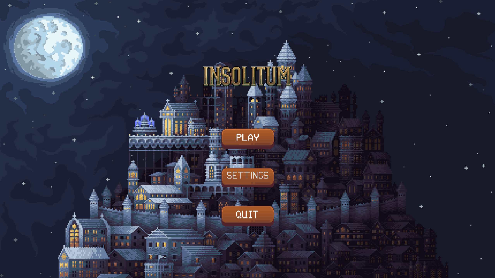

# 'ℑ𝔫𝔰𝔬𝔩𝔦𝔱𝔲𝔪'

- Roguelike game for ICT PO5

- Group 4: Luka, Ingmar, Igor, Mika

## Instructions:
- Use f11 for fullscreen

- Use WASD controls for moving

- Use LMB for attacking
  
## Weapons
- 1 = empty
- 2 = dagger
- 3 = revolver
- 4 = shotgun
- 5 = sniper

## Stack used for project
- Tiled for map creation
- Pygame library
- Audacity & Ableton for music / sfx
  
  

